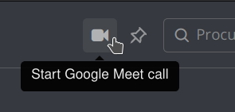
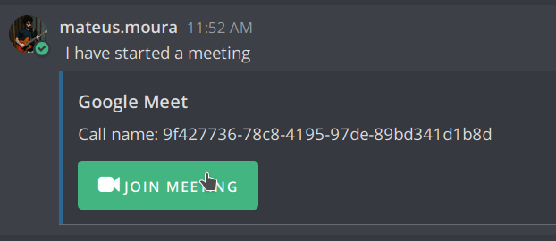

> This repo has been moved to https://github.com/SrMouraSilva/mattermost-google-meet-plugin

# Google Meet Plugin

The **Google Meet Plugin** add a button in the header bar in all calls:

When a user press the button, a room with a random name (UUID pattern) is created. A message is automaticaly created with the room:

## Usage & Setup Guide

### Commands

No command support. Please, send pull requests :D

### Installation

To generate a version, run `sh make.sh` and add it on Mattermost.

## Development

This plugin contains currently only web app portion.
